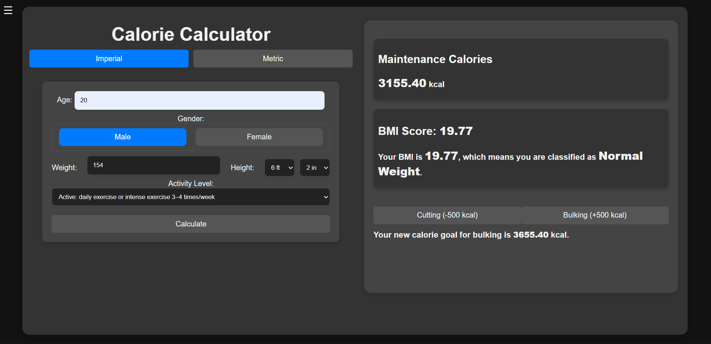

<h1 align="center">Hugo Lopez Garcia — Portfolio</h1>
<p align="center">
	<a href="https://soyhugo.github.io" target="_blank" rel="noreferrer">Live site</a>
	·
	<a href="https://github.com/soyhugo/soyhugo.github.io/issues">Report bug</a>
	·
	<a href="https://github.com/soyhugo/soyhugo.github.io/pulls">Request feature</a>
	<br />
	React-based personal site with an animated hero, a spotlight projects carousel, and a responsive layout.
</p>

<p align="center">
	
	<br />
	<em>Example slide from the spotlight carousel</em>
</p>

## ✨ Features

- Typewriter headline that doesn’t shift layout
- Spotlight carousel with project screenshots
- Projects grid with quick GitHub links
- Polished, responsive styles

## 🧰 Tech

- React 17 (Create React App)
- React Bootstrap (Carousel), Bootstrap 4
- Material UI Icons

## 🚀 Quick start

Prereqs: Node 16+ (18/20 recommended), npm 7+

```powershell
# install deps
npm install

# start dev server at http://localhost:3000
npm start
```

## 🏗️ Build

```powershell
npm run build
```
Outputs a production bundle in `build/`.

## 🌐 Deploy (GitHub Pages)

This repo is a user site (soyhugo.github.io). GitHub Pages serves from the root of the default branch. Two options:

1) Use the provided script to publish the `build/` folder to a branch Pages serves from.

```powershell
npm run deploy
```

Note: The script currently pushes to `master` (`-b master`). If your Pages is on `main`, change it in `package.json` to `-b main`.

2) Manual: build locally and commit the contents of `build/` to the branch Pages serves from.

Custom domain: Put your domain (e.g., `hugolopez.dev`) in the root `CNAME` file.

## 📁 Structure

```
src/
	components/     # React components (Intro, Projects, etc.)
	styles/         # CSS per section
public/
	assets/         # Images used in the carousel and pages
```

## 📜 Scripts

- `npm start` — dev server
- `npm run build` — production build
- `npm test` — CRA tests
- `npm run deploy` — publish build (adjust target branch as needed)

## 🤝 License

All rights reserved. Open an issue if you’d like to reuse parts of this project.

